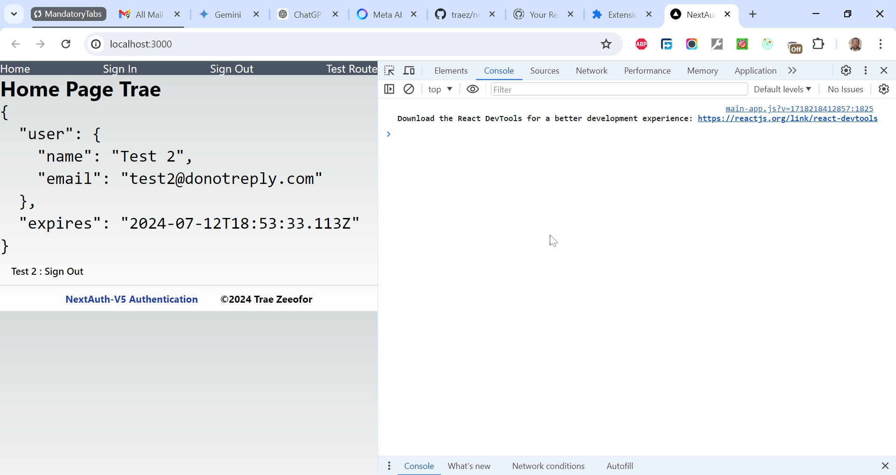

# Authentication in Next.js using NextAuth.js v5 (aka Auth.js)

This is a solution to [Next-Auth v5 is Almost Here! Learn it Fast on the NextJS App Router TODAY! Project](https://www.youtube.com/watch?v=z2A9P1Zg1WM). I'm practicing and developing my coding competency by building projects after projects.

## Table of contents

- [Overview](#overview)
  - [The challenge](#the-challenge)
  - [Screenshot](#screenshot)
  - [Links](#links)
  - [My process](#my-process)
  - [Built with](#built-with)
  - [What I learned](#what-i-learned)
  - [Continued development](#continued-development)
  - [Useful resources](#useful-resources)
  - [Author](#author)
  - [Acknowledgments](#acknowledgments)

## Overview

### The Challenge/User Stories

Next-auth is an easy way to get started with authentication in your NextJS App Router application. Let's get it set up, and see how to secure routes, server actions, API routes and client and server API requests!

### Screenshot

### Links

- Solution URL: [https://github.com/traez/next-auth-v5-authentication](https://github.com/traez/next-auth-v5-authentication)
- Live Site URL: [https://next-auth-v5-authentication.vercel.app/](https://next-auth-v5-authentication.vercel.app/)

## My process

### Built with

- Semantic HTML5 markup
- CSS custom properties
- Flexbox and CSS Grid
- Mobile-first workflow
- [React](https://reactjs.org/) - JS library
- [Next.js](https://nextjs.org/) - React framework**
- Tailwind CSS**   
- Typescript
- Nodejs (with/without Expressjs)
- MongoDB**  
- GraphQL**    
- Redux Toolkit**  
- NextAuth.js v5 (aka Auth.js)   

### What I learned
   
- **Auth.js** is a runtime-agnostic library based on standard Web APIs that integrates deeply with multiple modern JavaScript frameworks to provide an authentication experience that’s simple to get started with, easy to extend, and always private and secure! Also known as **NextAuth.js version 5**, it is a major rewrite of the next-auth package. Both can be installed with the command: `npm install next-auth@beta`.  
- **Brief descriptions of each dependency:**  
`@radix-ui/react-slot`: A utility for rendering slots in React, from the Radix UI library.
`class-variance-authority`: A utility for generating class names based on props, used for styling and variants.  
`clsx:` A utility for conditionally joining CSS classes, making it easy to manage class names in React.
`lucide-react`: A React library for using the Lucide icon set.
`tailwind-merge`: A utility for merging Tailwind CSS classes, making it easy to combine utility classes.
`tailwindcss-animate`: A plugin for adding animations to Tailwind CSS, providing a range of animation utilities. 
- `npm install next-auth@beta`: This command will install the latest beta version of the next-auth package, as recommended in the documentation.  
- `import NextAuth, { User, NextAuthConfig } from "next-auth";`: Imports the NextAuth package and its types (User and NextAuthConfig) for authentication management.
- `export const BASE_PATH = "/api/auth";`: Defines the base path for authentication routes.  
- `const authOptions: NextAuthConfig = {...}`: Configures NextAuth with an empty provider list, the defined base path, and a secret key from an environment variable. 
- `export const { handlers, auth, signIn, signOut } = NextAuth(authOptions);`: Initializes NextAuth with the configured options and exports the authentication handlers, auth function, and sign-in/sign-out functions.  
- **Providers**: These are the different ways users can authenticate themselves in the application. **Credentials** as a type of Provider allow users to sign in using a username and password.
- In Next.js, a folder like `[id], [params], [...nextauth]` represents a catch-all dynamic route, allowing the file to handle multiple routes under a common path, such as `/api/auth/*`. This is useful for managing various authentication endpoints with NextAuth.js, such as `/api/auth/signin` and `/api/auth/signout`.
- In this NextAuth app, the name `[...nextauth]` is significant because it matches the default route configuration used by NextAuth.js for handling authentication endpoints.
- `import { handlers } from "@/auth";`: As the handlers are exported from `src/auth/index.ts`, this import statement will correctly resolve to `src/auth/index.ts`. When you import from a directory, Node.js and modern JavaScript bundlers (like Webpack) automatically look for an `index.ts` or `index.js` file within that directory.
- **WhoAmIAPI (Client-side)**: Fetches data after the component is mounted using the `useEffect` hook. The user state is updated asynchronously after the API call is successful. 
- **WhoAmIRSC (Server-side rendering)**: Fetches data during the initial server-side rendering. The user data is available asynchronously (but often referred to as "synchronous" in the context of server-side rendering) during rendering. 
- **WhoAmIServerAction**: This is a server-side action intended for server-side rendering. However, in this specific implementation, it uses React Hooks (`useState` and `useEffect`), which are typically used for client-side rendering. This is possible because Next.js uses a technique called "server-side rendering with client-side hydration".
- **middleware.ts**: This code is a Next.js middleware that checks if the request is authenticated (`req.auth`). If not authenticated and the request is not for the root path ("/"), it redirects the user to the signin page, passing the original URL as a query parameter (`callbackUrl`). The signin page is assumed to be located at `${BASE_PATH}/signin`. In essence, this middleware enforces authentication for all pages except the root page and the signin page. 
- **AuthButton.server**: This code is a Next.js component that checks if the user is authenticated using the `auth()` function. If authenticated, it extracts the user's name and email from the session, wraps the `AuthButtonClient` component with the `SessionProvider` component from `next-auth/react`, and passes the session object and basePath to the `SessionProvider`. In essence, this component manages user authentication and provides the authenticated session to the `AuthButtonClient` component.
- **AuthButton.client**: This code is a Next.js component that uses the `useSession` hook from `next-auth/react` to get the user's session. If the user is signed in, it displays a button with the user's name and a "Sign Out" label. If the user is not signed in, it displays a "Sign In" button. The buttons trigger the `signOut` and `signIn` functions from the `@/auth/helpers` module. In essence, this component displays a button that toggles between "Sign In" and "Sign Out" based on the user's authentication status.
- **React file naming conventions:**
**Title Case (PascalCase)** for Components: This aligns with the convention and makes it clear that the file exports a component.
**Lower Case** for routing files, utility functions, constants, and configuration files. This distinguishes them from component files.   

### Continued development

- More projects; increased competence!

### Useful resources

Stackoverflow  
YouTube  
Google  
ChatGPT

## Author

- Website - [Trae Zeeofor](https://github.com/traez)
- Twitter - [@trae_z](https://twitter.com/trae_z)

## Acknowledgments

-Jehovah that keeps breath in my lungs
